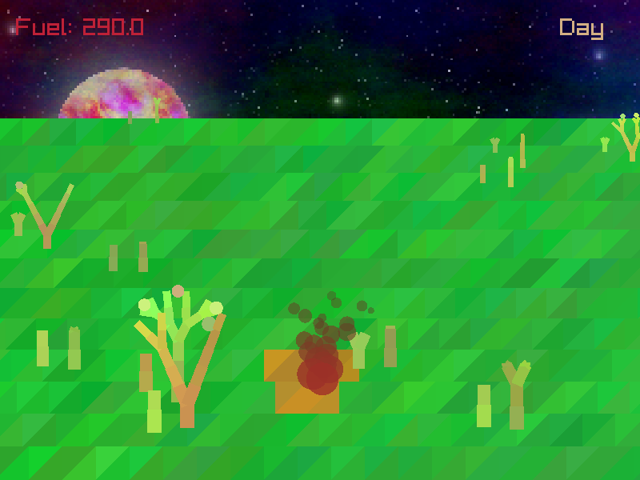

-----------------------------------

_DISCLAIMER:_

Welcome to **Kasaival**!

-----------------------------------

## Kasaival




## Description

Kasaival is a survival game where you play as a fiery flame in a new world of scorching heat and harsh conditions. Devour plants to survive and protect yourself from water mobs, all while trying to level up to gain new abilities and survive as long as possible in the pits of hell.

## Features

- Survival gameplay
- Devour plants to stay alive
- Protect yourself from water mobs
- Level up to gain new abilities

## Controls

- Move: Mouse or arrow keys/WASD
- Attack: Right mouse button

## Developers

- Waotzi - Lead Developer and Designer

## Links

- [itch.io Release](https://waotzi.itch.io/kasaival)

## Build Instructions

This build script allows you to compile and run the game on different platforms with optional features. Here are the detailed instructions:

### Building for Desktop

To build the game for desktop platforms, simply run the following command:

```nim r build.nim```

This command will compile the game in release mode for your current platform.

### Building for the Web

To build the game for the web using Emscripten, use the following command:

```nim r build.nim -b:web```

This command will compile the game in release mode using the Emscripten compiler, which generates a WebAssembly binary that can be run in web browsers.

### Optional Parameters

The build script has some additional parameters that you can use for more control over the build process:

1. Run the game after building: Add the `-r` or `--run` flag to the command to automatically run the game after building it. For example:

```nim r build.nim -r```

2. Upload the game to itch.io: Add the `-u` flag to the command to upload the game to your itch.io account after building. For example:

```nim r build.nim -b:web -u```

This will build the game for the web, zip the public folder, and upload it to your specified itch.io project.

To use multiple optional parameters, simply include them in the command. For example, to build the game for desktop, run it, and upload it to itch.io, use the following command:

```nim r build.nim -r -u```

Remember to replace `waotzi/kasaival` with your own itch.io username and project name in the build script.


## License

This game is licensed under the GPL v3 license. See [LICENSE](LICENSE) for details.
